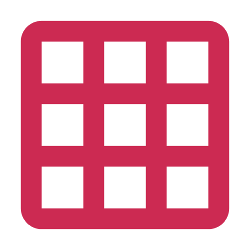
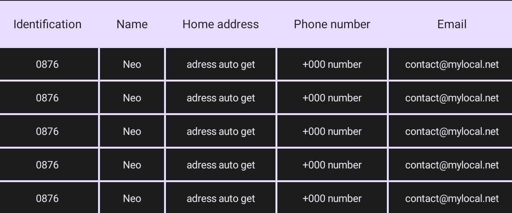
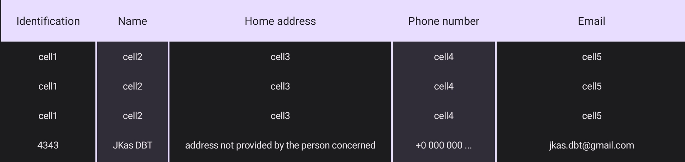
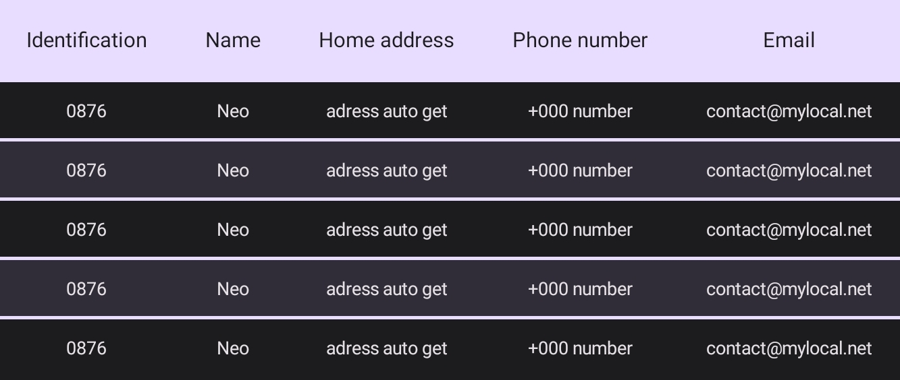

<p align ="center"></p>
<h1 align ="center">DataGridVlew</h1>

### Screenshots

 - basic style without color pattern
<p align ="center"></p>

 - With color pattern and with vertical diviser only
<p align ="center"></p>

- With color pattern and with horizontal diviser only
<p align ="center"></p>


<br><br>
## Required 
Integrate the DataGridVlew module into your project 

<br><br>
## Usage

include the namespace in your xml layout file :
```xml
xmlns:app="http://schemas.android.com/apk/res-auto"
```

<br><br>
## DataGridVlew xml code
```xml
<jkas.datagridview.DataGridView
    android:id="@+id/data_grid_view"
    android:layout_height="match_parent"
    android:layout_width="match_parent"
    app:diviserSize="2dp"
    app:diviserColor="@color/backgroundColorHeader"
    app:diviserHeaderColor="@android:color/transparent"
    app:columnCount="5"
    app:columnHeaderTextColor="@color/textColorHeader"
    app:columnHeaderBackgroundColor="@color/backgroundColorHeader"
    app:columnHeaderHeight="43dp"
    app:showVerticalSeparator="true"
    app:showHorizontalSeparator="true"
    app:rowHeight="30dp"
    app:rowTextColor="@color/textColorRow"
    app:rowBackgroundColor="@color/backgroundColorRow" />
```

<br><br>
## Implementation
- To add data to the grid, you need to create an object of type `Row` from the DataGridView.
from this new object created (`Row`), you would add new cells that will represent the data of the column. the object `Cell` can only be created from the line (object) `Row` that was created (`rowObject.newCell()`)

java
``` java
DataGridView dataGV = binding.dataGridView; // get the DataGridVlew view via findViewById or DataBinding
Row row = dataGV.newRow(); // create the new row from the DataGridVlew.
// adding Cell in Row object
row.addCell(row.newCell().setTextContent("data cell 1"));
row.addCell(row.newCell().setTextContent("data cell 2"));
row.addCell(row.newCell().setTextContent("data cell 3"));
row.addCell(row.newCell().setTextContent("data cell 4"));
row.addCell(row.newCell().setTextContent("data cell 5"));

// adding Row line in DataGridVlew.
dataGV.addRow(row);
```

kotlin
```kotlin
val dataGV = binding.dataGridView //get the DataGridVlew view via findViewById or DataBinding.
val row = dataGV.newRow() // creating the record row (Row)
row.addCell(row.newCell().setTextContent("data cell 1"))
row.addCell(row.newCell().setTextContent("data cell 2"))
row.addCell(row.newCell().setTextContent("data cell 3"))
row.addCell(row.newCell().setTextContent("data cell 4"))
row.addCell(row.newCell().setTextContent("data cell 5"))

// adding Row line in DataGridVlew.
dataGV.addRow(row)
```

<br><br>
- By default for all `Cell`s, the default generated view will be the `TextView`.
you can also customize your own views which are embedded in the `Cell`s.

java
```java
View myCustomView = ...; // The view you prefer to use instead of the one that will be created by default.
Row row = dataGV.newRow();
Row.Cell cell = row.newCell();
cell.setView(myCustomView);
row.addCell(cell);
````
kotlin
```kotlin
val myCustomView = ... // The view you prefer to use instead of the one that will be created by default.
val row = dataGV.newRow()
val cell = row.newCell()
cell.setView(myCustomView)
row.addCell(cell)
````

<br><br>
- Creating the grid header always follows the same procedure which consists of creating a `Row` either via the `newRow()` method
.

java
```java
Row rowHeader = dataGV.newRow();
rowHeader.addCell(...); // adding all necessary cells.
// set or update header
dataGV.setHeader(rowHeader);
```
kotlin
```kotlin
val rowHeader = dataGV.newRow()
rowHeader.addCell(...) // adding all necessary cells.
// set or update header
dataGV.setHeader(rowHeader)
```

<br><br>
- For setting up color patterns (as in screenshots) it's pretty simple. you just need to get the object keeps the default settings of the DataGridView and change its values `DefaultSetting`.

java
```java
DataGridVlew.DefaultSetting setting = dataGV.getDefaultSetting(); // getting the DefaultSetting object.
setting.usePattern = true;

// for columns only.
setting.addColorInListColumn(Color.RED);
setting.addColorInListColumn(Color.GREEN);


// for rows only
setting.addColorInListRow(Color.RED);
setting.addColorInListRow(Color.GREEN);
//...
```

kotlin
```kotlin
val setting = dataGV.getDefaultSetting() // getting the DefaultSetting object.
setting.usePattern = true

// for columns only.
setting.addColorInListColumn(Color.RED)
setting.addColorInListColumn(Color.GREEN)


// for rows only
setting.addColorInListRow(Color.RED)
setting.addColorInListRow(Color.GREEN)
//...
```
If you want to use this multiple coloring of columns and/or rows, let the value of `usePattern` be `true`

<br><br>
## Attributs
| XML Attributs | Code Method | Description |
|-------------|-------------|------------------------------------|
| `app:diviserSize` | `setDiviserSize(int size)`| the size of the column and row divider |
| `app:diviserColor` | `setDiviserColor(int color)`| The colors of the loaded data grid dividers  |
| `app:diviserHeaderColor` | `setDiviserHeaderColor(int color)`| The color of the grid header dividers. |
| `app:columnCount` | `setColumnCount(int counter)`| The maximum number of columns allowed  |
| `app:columnHeaderTextColor` | `setColumnHeaderTextColor(int color)`| The header text color |
| `app:columnHeaderBackgroundColor` | `setColumnHeaderBackgroundColor(int color)`| The header background color|
| `app:columnHeaderHeight` | `setColumnHeaderHeight(float dimen)`| the height size of the header |
| `app:showVerticalSeparator` | `showVerticalSeparator(boolean show)`| Show vertical divider  |
| `app:showHorizontalSeparator` | `showHorizontalSeparator(boolean show)`| Show horizontal divider |
| `app:rowHeight` | `setRowHeight(float dimen)`| the height size of the row |
| `app:rowTextColor` | `setRowTextColor(int color)`| The row text color |
| `app:rowBackgroundColor` | `setRowBackgroundColor(int color)`| The row background color |

<br><br>
## Note
It is important to know this before loading data into the grid :
- set `columnCount` before data loading, Otherwise an exception will be thrown.
- the number of `Cell`s added must be equal to `columnCount` otherwise an exception will be thrown if the number of `Cell`s is greater than the limit `columnCount`.
- if the number of `Cell`s is less than `columnCount`, `Cell`s will be added with default values `(none)` to fill the gaps.

<br><br>
## Contact
- Telegram: https://t.me/jkas_dbt
- Gmail : jkas.dbt@gmail.com

<br><br>
## Thanks to
- Rosette Bikangu for Support
- [Andi Hasan A](https://github.com/hasanelfalakiy)
- [Akash Yadav](https://github.com/itsaky) for creating [AndroidIDE](https://github.com/AndroidIDEOfficial/AndroidIDE)
